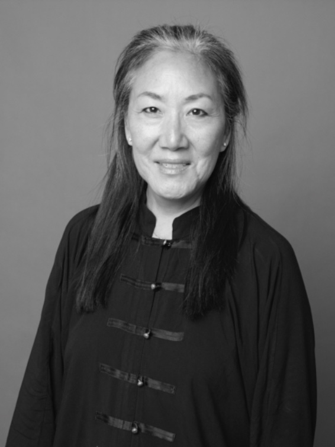

+++
title = "„Wann können wir zurückkehren?“ – Wie die Flucht Karma Lobsang`s Eltern ihre Sicht auf Heimat, Gerechtigkeit und Integration veränderte"
date = "2025-03-14"
draft = false
pinned = false
tags = []
+++


Heimat, Sicherheit, Gerechtigkeit – und die Frage nach Zugehörigkeit. Wie die Fluchterfahrungen meiner Großeltern meine Mutter prägte und wie diese Erfahrungen ihre Sicht auf Integration und Vorurteile beeinflusst.



**Welche Werte hast du von deinen Eltern übernommen?** 

Meinen Eltern war es wichtig, dass wir freundlich und ehrlich zu anderen Menschen sind. Sie legten großen Wert darauf, dass wir uns stets bemühen und auch Disziplin in allem zeigen, was wir tun.

> Meine Sicht auf Heimat hat sich dadurch verändert, dass es nicht unbedingt ein Ort sein muss, bei dem ich das Gefühl von Heimat habe, sondern es mehr die Menschen sind. 

**Inwiefern hat die Flüchtlingssituation deiner Eltern deine Sicht auf Heimat verändert?** 

Meine Eltern sind beide aus Tibet geflüchtet, und sie haben meine Schwester und mich so erzogen, dass wir immer damit gerechnet haben, eines Tages zurückzukehren, wenn Tibet wieder frei ist. Wir haben sehr lange in der Schweiz gelebt, als wäre es ein vorübergehender Zustand. Die Frage war ständig: Wann wird Tibet frei, und wann können wir zurückkehren? Gleichzeitig wuchs ich hier auf – ich wurde in der Schweiz geboren und im Engadin aufgezogen. Ich war eng mit meinen Freundinnen und Freunden sowie dem Leben dort verbunden. Dieses Leben war Heimat für mich. Doch ebenso war auch Tibet, das meine Eltern aufgrund der chinesischen Besetzung verlassen mussten, ein Teil von Heimat. Meine Sicht auf Heimat hat sich dadurch verändert, dass es nicht unbedingt ein Ort sein muss, bei dem ich das Gefühl von Heimat habe, sondern es mehr die Menschen sind. 

> Ab wann ist man „gut integriert“? Solche Fragen haben mich bereits in jungen Jahren sehr beschäftigt.

**Hast du Vorurteile aufgrund der Herkunft deiner Eltern erlebt?** 

Ja, habe ich. Während der Kindheit und Jugend, waren wir eine Visible Minority, man hat uns angesehen aufgrund unserer Erscheinung, der asiatischen Erscheinung, dass wir nicht Engadiner, Engadinerinnen sind. Ich bin verschiedenen Formen von Vorurteilen begegnet. Auch von Lehrpersonen gab es Vorurteile, zum Beispiel, dass sie dachten, ich hätte gute Noten nur aus Mitleid bekommen, ohne zu erkennen, dass ich tatsächlich gute Leistungen erbracht hatte.

**Wie hat die Vergangenheit deiner Eltern deine Perspektive auf Gerechtigkeit oder Integration beeinflusst?** 

Die Flucht meiner Eltern und Großeltern sowie ihre ständige Hoffnung auf die Freiheit Tibets und eine mögliche Rückkehr haben mir gezeigt, wie ungerecht vieles in der Welt ist. Schon früh habe ich mich mit den Themen Gerechtigkeit und Gleichwertigkeit auseinandergesetzt, weil ich diese Ungerechtigkeiten direkt wahrgenommen habe. Ähnlich war es mit dem Thema Integration. Es gab immer wieder die Frage, was es eigentlich bedeutet, dazuzugehören – was muss man tun, um als integriert zu gelten, und ab wann ist man „gut integriert“? Solche Fragen haben mich bereits in jungen Jahren sehr beschäftigt.

**Wie hat das Leben deiner Eltern als Flüchtlinge deine Karriereziele beeinflusst?** 

Der Sinn für Gerechtigkeit und auch die Frage der Integration hatte wahrscheinlich schon einen Einfluss gehabt auf die Ausbildungen, die ich gemacht habe. Ich habe die Ausbildungen gemacht, die mich interessierten, und meine Eltern haben mich darin unterstützt. Zusammen mit der Erziehungs- und Bildungswissenschaft Soziologie habe ich Politologie studiert, wo es auch um die Frage geht, der gesellschaftliche Integration. Und habe mich sehr stark zu den pädagogischen Antworten auf Migrationsbewegungen beschäftigt. \
Bei der Mediationsausbildung, die ich noch gemacht habe, geht es darum, die unterschiedlichen Meinungen und Positionen zwischen zwei Menschen anzuhören, einen Beitrag zu leisten, indem ich und alle Meinungen als gleichwertig war nehme. Es geht darum, dass sich Menschen begegnen und gemeinsam eine Lösung finden können. Das hängt vielleicht auch zusammen mit dieser Fluchterfahrung, die ich schon von klein auf mitbekommen habe. 



Geboren 1966, Tochter von tibetischen Flüchtlingen, aufgewachsen im Engadin, ausgebildete Volksschullehrperson, Mediatorin, Achtsamkeitslehrerin, Hochschuldozentin, ehrenamtliche Tätigkeit als Präsidentin des Stiftungsrates des Tibet Institut Rikon.



\
**Hat die Fluchtgeschichte deiner Eltern deine Sicht auf Sicherheit verändert?** 

Für mich ist Sicherheit und Schutz ein grosses Thema ist. Wenn wir die Fluchterfahrungen meiner Eltern und meines Großvaters betrachten, der noch lange mit uns lebte und immer hoffte, in Tibet sterben zu können, was schließlich nicht der Fall war, wird deutlich, dass Sicherheit ein unerreichbares Ideal bleiben kann. Wahrscheinlich werden auch meine Eltern nicht in Tibet sterben, sondern hier, in der Schweiz. Das hat mir früh gezeigt, dass es keine absolute Sicherheit gibt, aber dass diese Sicherheit viele Menschen von Anfang an nicht erfahren. Sicherheit und Schutz sind Grundbedürfnisse, und wenn wir die vielen Kriege auf der Welt sehen und wissen, wie viele Menschen keinen Schutz haben, dann wird es beinahe zur Normalität, dass es in unserer Zeit so viele Menschen gibt, die keinen sicheren Ort kennen.

**Welche Lehren aus den Erfahrungen deiner Eltern sind für dich heute noch relevant?** 

Die wichtigste Lehre, die ich aus den Erfahrungen meiner Eltern mitgenommen habe, ist, immer freundlich, aber bestimmt zu bleiben. Ich achte sehr darauf, was für mich richtig ist und was nicht, und ich versuche, das auch klar zu kommunizieren. Dabei ist es mir wichtig, auch in schwierigen Gesprächen freundlich zu bleiben, selbst wenn meine Meinung der anderen Person nicht gefällt. Heisst sich zu integrieren bedeutet für mich nicht, sich vollständig aufzugeben oder sich völlig anzupassen, sondern eine gute Beziehung zu anderen Menschen aufzubauen und dabei authentisch zu bleiben. Es geht darum, Verantwortung für meine eigenen Wünsche, Bedürfnisse, Gefühle und Gedanken zu übernehmen, mich mit anderen auszutauschen und gleichzeitig zu wissen, dass ich nicht immer allem zustimmen muss , und das auf eine respektvolle und freundliche Weise zu tun.